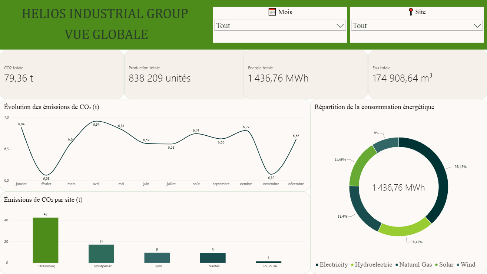
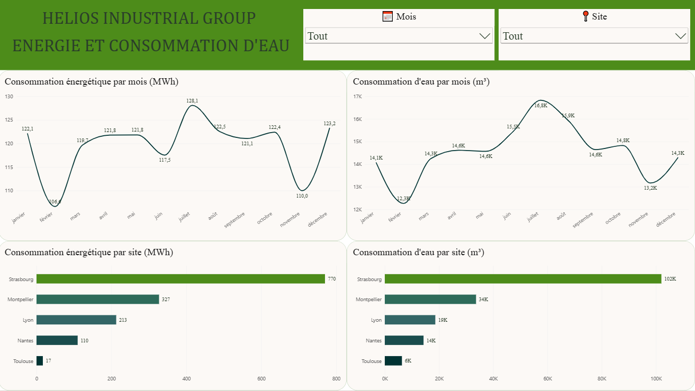
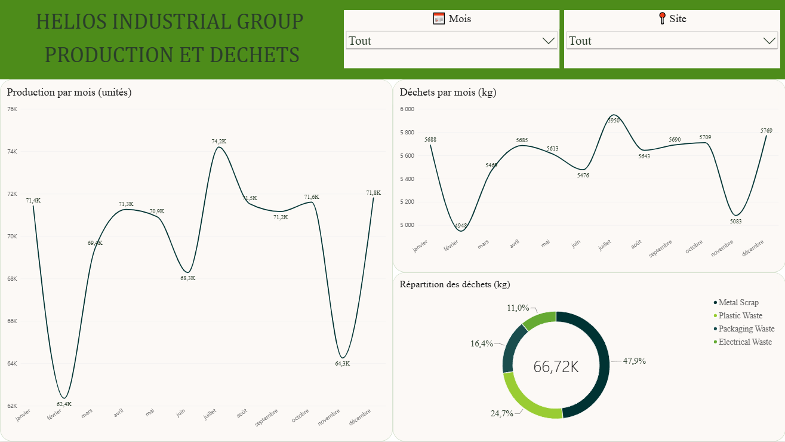
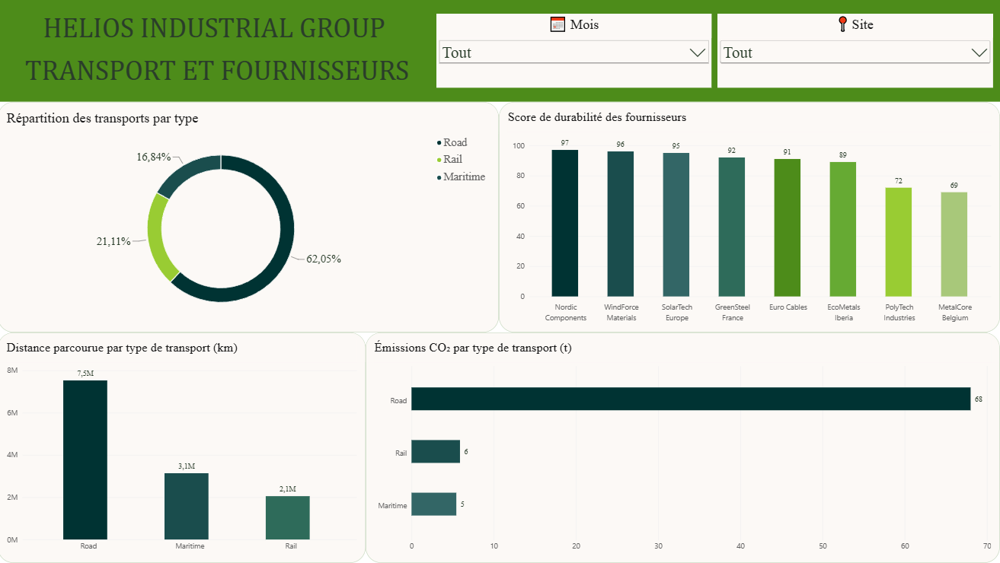
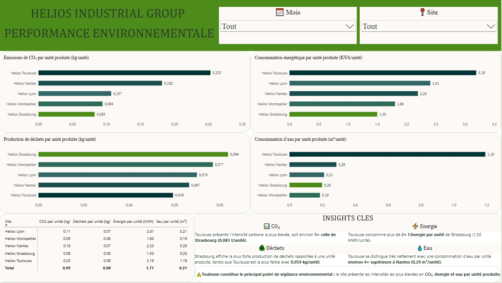

# 🌱 Industrial Sustainability Data Platform

> Une plateforme Data Engineering de bout en bout permettant de collecter, transformer, stocker et analyser les données environnementales et opérationnelles d'un groupe industriel fictif.

---

## 📌 Présentation du projet

**Industrial Sustainability Data Platform** est un projet de Data Engineering construit autour d'un groupe industriel fictif : **Helios Industrial Group**.

L'objectif du projet est de mettre en place une plateforme permettant de centraliser les données liées aux activités industrielles et à la performance environnementale de plusieurs sites de production.

La plateforme permet notamment d'analyser :

- ⚡ La consommation d'énergie
- 💧 La consommation d'eau
- 🏭 La production industrielle
- ♻️ Les déchets générés
- 🚚 Le transport et les émissions associées
- 🤝 Les fournisseurs
- 🌱 La performance environnementale des différents sites

Le projet couvre l'ensemble d'un pipeline de données moderne, depuis le traitement des données jusqu'à leur visualisation.

---

## 🎯 Objectifs

Les principaux objectifs du projet sont :

- 📥 Charger et traiter les données industrielles
- 🧹 Nettoyer et préparer les données avec Python
- 🗄️ Stocker les données dans une base MySQL
- 🔄 Transformer et modéliser les données avec dbt
- 📊 Construire des Data Marts destinés à l'analyse
- ⚙️ Orchestrer le pipeline avec Apache Airflow
- 🐳 Conteneuriser l'environnement avec Docker
- 📈 Visualiser les principaux KPI avec Power BI

---

## 🏗️ Architecture

```text
Données sources
      │
      ▼
 Python ETL
      │
      ▼
    MySQL
      │
      ▼
     dbt
      │
      ▼
  Power BI

Apache Airflow
      │
      └── Orchestration du pipeline
```

---

## 🛠️ Technologies utilisées

| Technologie | Utilisation |
|---|---|
| 🐍 Python | ETL et traitement des données |
| 🐼 Pandas | Manipulation et préparation des données |
| 🐬 MySQL | Stockage des données |
| 🔄 dbt | Transformation et modélisation des données |
| ⚙️ Apache Airflow | Orchestration du pipeline |
| 🐘 PostgreSQL | Base interne utilisée par Airflow |
| 🐳 Docker & Docker Compose | Conteneurisation de l'environnement |
| 📊 Power BI | Visualisation et analyse des données |
| 🔧 Git | Gestion des versions |
| ☁️ GitHub | Hébergement du projet |

---

## 📊 Modèle de données

La base de données principale utilisée par le projet est :

```text
helios_industrial_group
```

### Tables de référence

Les tables de référence décrivent les principales entités du groupe industriel :

- `site`
- `product`
- `supplier`
- `transport_company`
- `energy_source`

### Tables opérationnelles

Les données industrielles sont stockées dans les tables suivantes :

- `production`
- `energy`
- `water`
- `waste`
- `transport`

---

## 🔄 Pipeline de données

Le pipeline suit plusieurs étapes.

### 1️⃣ Initialisation de la base de données

Lors du premier démarrage de MySQL avec Docker, les scripts SQL présents dans le dossier `sql/` sont exécutés automatiquement.

Ils permettent de :

- créer la base de données ;
- créer les tables ;
- insérer les données de référence.

### 2️⃣ ETL avec Python

Le pipeline Python permet de traiter les données avant leur chargement dans MySQL.

Les données sont extraites, transformées, validées puis chargées afin d'être exploitables dans le pipeline analytique.

### 3️⃣ Transformations avec dbt

dbt est utilisé pour structurer les données selon plusieurs couches.

#### 🟢 Staging

Les modèles `stg_*` permettent de standardiser et préparer les données sources.

Ils sont matérialisés sous forme de **Views**.

Exemples :

- `stg_energy`
- `stg_energy_source`
- `stg_product`
- `stg_production`
- `stg_site`
- `stg_supplier`
- `stg_transport`
- `stg_transport_company`
- `stg_waste`
- `stg_water`

#### 🟡 Intermediate

Les modèles `int_*` permettent de réaliser des transformations intermédiaires plus avancées.

Exemples :

- `int_energy_allocated`
- `int_production_product_share`
- `int_water_allocated`

Ils sont matérialisés sous forme de **Views**.

#### 🔵 Data Marts

Les modèles `mart_*` correspondent aux tables finales utilisées pour l'analyse et la visualisation.

- `mart_energy`
- `mart_production`
- `mart_supplier`
- `mart_transport`
- `mart_waste`
- `mart_water`

Ces modèles sont matérialisés sous forme de **Tables**.

---

## ⚙️ Orchestration avec Apache Airflow

Apache Airflow permet d'automatiser les différentes étapes du pipeline.

Le DAG principal exécute les étapes suivantes :

```text
ETL Python
    │
    ▼
dbt run
    │
    ▼
dbt test
```

L'interface Airflow permet notamment de :

- visualiser les tâches du pipeline ;
- suivre leur état ;
- consulter les logs ;
- relancer le pipeline manuellement ;
- vérifier que toutes les étapes se terminent correctement.

---

## 🐳 Infrastructure Docker

L'ensemble de l'environnement est exécuté avec Docker Compose.

Les principaux services sont :

| Service | Rôle |
|---|---|
| 🐬 MySQL | Base de données principale du projet |
| 🐘 PostgreSQL | Base interne utilisée par Airflow |
| ⚙️ Airflow Webserver | Interface graphique Airflow |
| 🔄 Airflow Scheduler | Exécution et planification des tâches |

---

# 🚀 Installation et utilisation

## 1️⃣ Prérequis

Avant de commencer, installe les logiciels suivants.

### 🐳 Docker Desktop — Obligatoire

Docker Desktop est nécessaire pour exécuter l'ensemble de l'infrastructure :

- MySQL
- PostgreSQL
- Apache Airflow
- dbt

Vérifie l'installation :

```bash
docker --version
docker compose version
```

### 🔧 Git — Obligatoire

Git est nécessaire pour récupérer le projet depuis GitHub.

Vérifie l'installation :

```bash
git --version
```

### 🐬 MySQL Workbench — Optionnel

MySQL Workbench permet de consulter facilement la base de données créée par Docker.

### 📊 Power BI Desktop — Optionnel

Power BI Desktop est nécessaire pour ouvrir et modifier le dashboard `.pbix`.

---

## 📥 2️⃣ Récupérer le projet

Clone le repository :

```bash
git clone <URL_DU_REPOSITORY>
```

Puis entre dans le dossier :

```bash
cd industrial-sustainability-data-platform
```

---

## 🔐 3️⃣ Configurer les variables d'environnement

Le fichier `.env` contient les variables nécessaires à la connexion à MySQL.

Pour des raisons de sécurité, il n'est pas inclus dans le repository GitHub.

Un fichier modèle est fourni :

```text
.env.example
```

Crée une copie.

### 🪟 Windows PowerShell

```powershell
Copy-Item .env.example .env
```

### 🐧 Linux / macOS

```bash
cp .env.example .env
```

Ensuite, ouvre le fichier `.env` et définis ton mot de passe MySQL.

Exemple :

```env
MYSQL_HOST=mysql
MYSQL_PORT=3306
MYSQL_USER=root
MYSQL_PASSWORD=VotreMotDePasse
MYSQL_DATABASE=helios_industrial_group
```

⚠️ Le fichier `.env` ne doit jamais être ajouté à GitHub.

---

## 🐳 4️⃣ Démarrer la plateforme

Depuis le dossier principal du projet :

```bash
docker compose up -d --build
```

Docker va automatiquement :

- 🐬 démarrer MySQL ;
- 🗄️ créer la base `helios_industrial_group` ;
- 📋 créer les tables ;
- 📥 insérer les données de référence ;
- 🐘 démarrer PostgreSQL ;
- ⚙️ initialiser Apache Airflow ;
- 🌐 démarrer l'interface Airflow ;
- 🔄 démarrer le Scheduler.

---

## 🔎 5️⃣ Vérifier les services

Pour vérifier que les conteneurs fonctionnent :

```bash
docker compose ps
```

Les services principaux devraient apparaître comme actifs :

```text
mysql
postgres
airflow-webserver
airflow-scheduler
```

---

## ⚙️ 6️⃣ Accéder à Apache Airflow

Ouvre ton navigateur et rends-toi sur :

`http://localhost:8080`

Identifiants :

```text
Utilisateur : admin
Mot de passe : admin
```

Une fois connecté, tu peux accéder au DAG du pipeline.

---

## ▶️ 7️⃣ Exécuter le pipeline

Dans Airflow :

1. Ouvre le DAG du pipeline.
2. Active le DAG si nécessaire.
3. Clique sur **Trigger DAG**.
4. Attends la fin de l'exécution.

Le pipeline exécute :

```text
run_etl
    │
    ▼
run_dbt
    │
    ▼
test_dbt
```

Lorsque toutes les tâches apparaissent en vert 🟢, le pipeline a été exécuté avec succès.

---

## 🐬 Consulter la base de données

La base MySQL est exécutée dans Docker.

Si tu utilises MySQL Workbench, crée une connexion avec les paramètres suivants :

```text
Host : localhost
Port : 3307
Username : root
Password : valeur définie dans le fichier .env
```

La base principale est :

```text
helios_industrial_group
```

Elle contient les tables sources, les Views dbt et les Data Marts.

---

# 📊 Dashboard Power BI

Le projet inclut un dashboard Power BI permettant d'analyser les performances environnementales et opérationnelles de **Helios Industrial Group**.

## 🏠 Overview

Cette page propose une vue d'ensemble des principaux indicateurs et performances du groupe industriel.



---

## ⚡ Energy & Water Consumption

Cette page permet d'analyser la consommation énergétique et la consommation d'eau des différents sites industriels.



---

## 🏭 Production & Waste

Cette page présente les indicateurs liés à la production industrielle et aux déchets générés.



---

## 🚚 Transport & Suppliers

Cette page permet d'analyser les données liées au transport, aux émissions et aux fournisseurs.



---

## 🌱 Environmental Performance

Cette page présente une vue globale des performances environnementales des différents sites industriels.



---

# 📁 Structure du projet

```text
industrial-sustainability-data-platform/
│
├── .env.example
├── .gitignore
├── Dockerfile
├── README.md
├── docker-compose.yml
│
├── dags/
│   └── airflow_pipeline.py
│
├── dashboard/
│   ├── industrial_sustainability.pbix
│   │
│   └── screenshots/
│       ├── energy_water.PNG
│       ├── environmental_performance.PNG
│       ├── overview.PNG
│       ├── production_waste.PNG
│       └── transport_suppliers.PNG
│
├── data/
│   └── raw/
│       ├── energy.csv
│       ├── production.csv
│       ├── transport.csv
│       ├── waste.csv
│       └── water.csv
│
├── dbt/
│   ├── .gitignore
│   ├── dbt_project.yml
│   ├── profiles.yml
│   │
│   └── models/
│       ├── intermediate/
│       │   ├── int_energy_allocated.sql
│       │   ├── int_production_product_share.sql
│       │   └── int_water_allocated.sql
│       │
│       ├── marts/
│       │   ├── mart_energy.sql
│       │   ├── mart_production.sql
│       │   ├── mart_supplier.sql
│       │   ├── mart_transport.sql
│       │   ├── mart_waste.sql
│       │   ├── mart_water.sql
│       │   └── schema.yml
│       │
│       └── staging/
│           ├── _sources.yml
│           ├── schema.yml
│           ├── stg_energy.sql
│           ├── stg_energy_source.sql
│           ├── stg_product.sql
│           ├── stg_production.sql
│           ├── stg_site.sql
│           ├── stg_supplier.sql
│           ├── stg_transport.sql
│           ├── stg_transport_company.sql
│           ├── stg_waste.sql
│           └── stg_water.sql
│
├── docs/
│   ├── 00_Project_Overview.md
│   ├── 01_Business_Analysis.md
│   ├── 02_Technical_Architecture.md
│   ├── 03_Data_Model.md
│   ├── 04_Data_Generation.md
│   │
│   └── diagrams/
│       ├── architecture.drawio
│       ├── architecture.png
│       ├── data_generation_pipeline.drawio
│       ├── data_generation_pipeline.png
│       ├── data_model.drawio
│       ├── data_model.png
│       └── database_schema.png
│
├── sql/
│   ├── 01_create_tables.sql
│   └── 02_insert_reference_data.sql
│
└── src/
    ├── etl/
    │   ├── __init__.py
    │   ├── config.py
    │   ├── extract.py
    │   ├── load.py
    │   ├── pipeline.py
    │   ├── transform.py
    │   └── validate.py
    │
    └── generators/
        ├── __init__.py
        ├── config.py
        ├── generate_energy.py
        ├── generate_production.py
        ├── generate_transport.py
        ├── generate_waste.py
        ├── generate_water.py
        └── utils.py
```

---

## 🧪 Qualité des données

Le projet utilise dbt pour effectuer des contrôles sur les données.

Les tests permettent notamment de vérifier :

- l'absence de valeurs nulles sur certaines colonnes ;
- l'unicité de certains identifiants ;
- l'intégrité des relations entre les données ;
- la cohérence des données transformées.

Les tests sont exécutés après les transformations :

```text
dbt run
    │
    ▼
dbt test
```

---

## 🔄 Reproductibilité du projet

Le projet a été conçu pour être facilement reproductible.

Une personne récupérant le repository doit uniquement :

```text
1. Installer Docker Desktop
        ↓
2. Cloner le repository
        ↓
3. Créer le fichier .env
        ↓
4. Définir MYSQL_PASSWORD
        ↓
5. Lancer docker compose up -d --build
        ↓
6. Accéder à Airflow
        ↓
7. Exécuter le DAG
```

L'infrastructure Docker permet ensuite de recréer automatiquement l'environnement nécessaire au fonctionnement du projet.

---

## 🔮 Améliorations possibles

Plusieurs évolutions pourraient être ajoutées à la plateforme :

- ⏰ Planification automatique du DAG Airflow ;
- 🧪 Ajout de tests Python ;
- 🚀 Mise en place d'une CI/CD avec GitHub Actions ;
- 🔐 Utilisation d'un gestionnaire de secrets pour un environnement de production ;
- ☁️ Déploiement de l'infrastructure sur le Cloud ;
- 📊 Ajout de nouveaux KPI environnementaux ;
- 📥 Ajout de nouvelles sources de données ;
- 📈 Mise en place d'un monitoring plus avancé du pipeline.

---

# 👨‍💻 Auteur

**Lucas Masini**

Projet personnel réalisé dans le cadre du développement de compétences en :

- Data Engineering
- Python
- SQL
- ETL
- MySQL
- dbt
- Apache Airflow
- Docker
- Power BI

---

## ⭐ Conclusion

Ce projet met en œuvre une architecture complète de **Data Engineering**, allant du traitement des données jusqu'à leur visualisation.

**Python → MySQL → dbt → Airflow → Power BI**

L'infrastructure est reproductible grâce à **Docker**. 🚀🌱
