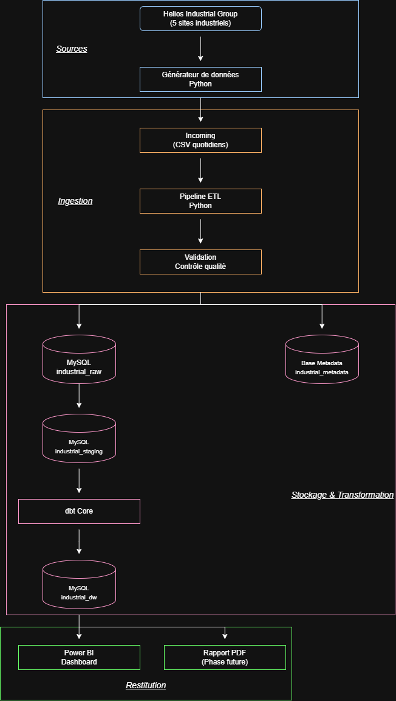

# 🏗️ Architecture Technique

## 🎯 Objectif

Cette architecture a été conçue afin de reproduire une plateforme de Data Engineering utilisée dans un contexte industriel.

L'objectif est de centraliser les données environnementales et opérationnelles provenant de plusieurs sites de production, de les traiter, de les stocker dans une base de données relationnelle, puis de les transformer afin de les rendre exploitables pour l'analyse décisionnelle.

La plateforme couvre l'ensemble du pipeline de données :

**Données CSV → Python ETL → MySQL → dbt → Power BI**

L'ensemble des traitements est orchestré avec **Apache Airflow** et l'environnement est conteneurisé avec **Docker**.

---

# 🏗️ Vue d'ensemble

Le schéma ci-dessous présente l'architecture globale de la plateforme.



---

# 🔄 Fonctionnement global

```
Données CSV
    │
    ▼
Python ETL
    │
    ▼
MySQL
    │
    ▼
dbt
    │
    ▼
Data Marts
    │
    ▼
Power BI
```

Apache Airflow orchestre le pipeline :

```
ETL Python
    │
    ▼
dbt run
    │
    ▼
dbt test
```

---

# 🏭 1. Helios Industrial Group

Le projet repose sur une entreprise industrielle fictive appelée **Helios Industrial Group**.

L'entreprise génère des données relatives à :

- la consommation d'énergie ;
- la consommation d'eau ;
- la production industrielle ;
- les déchets générés ;
- le transport ;
- les émissions associées au transport ;
- les fournisseurs.

Ces données constituent la base du pipeline de traitement.

---

# 📁 2. Données sources

Les données sources sont stockées sous forme de fichiers CSV dans :

```text
data/raw/
```

Les principaux fichiers sont :

- `energy.csv`
- `production.csv`
- `transport.csv`
- `waste.csv`
- `water.csv`

---

# 🐍 3. Génération des données

Le projet comprend plusieurs scripts Python permettant de générer les données utilisées par la plateforme.

Ces scripts sont regroupés dans :

```text
src/generators/
```

Ils permettent notamment de générer les données liées à l'énergie, la production, le transport, les déchets et l'eau.

---

# 🔄 4. Pipeline ETL Python

Le pipeline ETL est développé en Python et organisé dans :

```text
src/etl/
```

Il est composé de plusieurs étapes :

## Extraction

Les données sont lues depuis les fichiers CSV présents dans `data/raw/`.

## Transformation

Les données sont préparées et nettoyées avant leur chargement dans MySQL.

## Validation

Des contrôles sont réalisés afin de vérifier la cohérence et la qualité des données.

## Chargement

Les données transformées sont chargées dans la base de données MySQL.

L'organisation du pipeline repose notamment sur :

```text
extract.py
transform.py
validate.py
load.py
pipeline.py
```

---

# 🐬 5. Base de données MySQL

MySQL constitue la base de données principale du projet.

La base utilisée est :

```text
helios_industrial_group
```

Elle est automatiquement initialisée lors du premier démarrage de l'environnement Docker.

Les scripts SQL présents dans :

```text
sql/
```

permettent notamment de créer les tables et d'insérer les données de référence.

Les principales tables de référence sont :

- `site`
- `product`
- `supplier`
- `transport_company`
- `energy_source`

Les principales tables opérationnelles sont :

- `energy`
- `production`
- `transport`
- `waste`
- `water`

---

# 🔄 6. Transformations avec dbt

dbt est utilisé pour transformer et modéliser les données présentes dans MySQL.

Le projet est organisé en trois couches principales.

## 🟢 Staging

Les modèles de staging préparent et standardisent les données sources.

Ils sont matérialisés sous forme de **Views**.

Exemples :

- `stg_energy`
- `stg_energy_source`
- `stg_product`
- `stg_production`
- `stg_site`
- `stg_supplier`
- `stg_transport`
- `stg_transport_company`
- `stg_waste`
- `stg_water`

## 🟡 Intermediate

Les modèles intermédiaires réalisent des transformations avant la création des tables analytiques.

Exemples :

- `int_energy_allocated`
- `int_production_product_share`
- `int_water_allocated`

Ils sont matérialisés sous forme de **Views**.

## 🔵 Data Marts

Les Data Marts correspondent aux tables finales utilisées pour l'analyse et la visualisation.

Les modèles principaux sont :

- `mart_energy`
- `mart_production`
- `mart_supplier`
- `mart_transport`
- `mart_waste`
- `mart_water`

Ces modèles sont matérialisés sous forme de **Tables**.

---

# ⚙️ 7. Orchestration avec Apache Airflow

Apache Airflow est utilisé pour orchestrer les différentes étapes du pipeline.

Le DAG principal est présent dans :

```text
dags/airflow_pipeline.py
```

Il automatise l'exécution suivante :

```text
ETL Python
    │
    ▼
dbt run
    │
    ▼
dbt test
```

Airflow permet de visualiser les tâches, suivre leur état, consulter les logs et relancer les traitements.

---

# 🐘 8. PostgreSQL

PostgreSQL est utilisé comme base de données interne par Apache Airflow.

Cette base ne contient pas les données industrielles du projet. Elle permet à Airflow de gérer ses métadonnées, les DAGs, les exécutions et les tâches.

---

# 🐳 9. Infrastructure Docker

L'ensemble de l'environnement est conteneurisé avec Docker.

Docker Compose permet de démarrer les principaux services :

| Service | Rôle |
|---|---|
| MySQL | Base de données principale |
| PostgreSQL | Base interne d'Airflow |
| Airflow Webserver | Interface graphique |
| Airflow Scheduler | Exécution et planification des tâches |

Lors du démarrage, l'environnement initialise notamment MySQL, PostgreSQL et Apache Airflow.

L'environnement peut être lancé avec :

```bash
docker compose up -d --build
```

---

# 📊 10. Power BI

Power BI constitue la couche de visualisation finale de la plateforme.

Le dashboard est disponible dans :

```text
dashboard/industrial_sustainability.pbix
```

Il permet d'analyser les principaux indicateurs environnementaux et opérationnels de Helios Industrial Group.

Le dashboard contient notamment des analyses sur :

- ⚡ l'énergie ;
- 💧 l'eau ;
- 🏭 la production ;
- ♻️ les déchets ;
- 🚚 le transport ;
- 🤝 les fournisseurs ;
- 🌱 la performance environnementale.

---

# 🏗️ Choix techniques

## Python

Python est utilisé pour la génération des données et le développement du pipeline ETL.

## MySQL

MySQL est utilisé comme base de données principale du projet.

## dbt

dbt structure les transformations analytiques selon l'architecture :

```text
Sources
    │
    ▼
Staging
    │
    ▼
Intermediate
    │
    ▼
Data Marts
```

## Apache Airflow

Airflow orchestre les différentes étapes du pipeline.

## Docker

Docker permet de rendre l'environnement facilement reproductible.

## Power BI

Power BI permet de visualiser les données finales sous forme de tableaux de bord interactifs.


---

# ✅ Conclusion

L'architecture finale du projet repose sur un pipeline complet de Data Engineering :

```text
Données CSV
    ↓
Python
    ↓
MySQL
    ↓
dbt
    ↓
Data Marts
    ↓
Power BI
```

Apache Airflow assure l'orchestration du pipeline tandis que Docker permet de reproduire facilement l'ensemble de l'environnement.

Cette architecture couvre les principales étapes d'un projet de Data Engineering, depuis la génération et le traitement des données jusqu'à leur transformation et leur visualisation.
