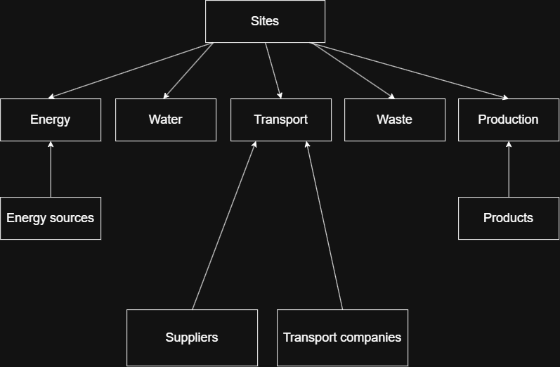

# Modèle de données relationnel

## Objectif

Ce document décrit le modèle de données de l'Industrial Sustainability Data Platform.

L'Industrial Sustainability Data Platform est développée pour l'entreprise fictive Helios Industrial Group.

Il présente les différentes tables de la base de données, leurs relations ainsi que les choix de conception retenus.

L'objectif est de construire une base de données normalisée, évolutive et adaptée aux traitements ETL, aux transformations dbt ainsi qu'à la création d'indicateurs environnementaux dans Power BI.

---

# Diagramme conceptuel

---

## Convention de nommage

Les tables et colonnes de la base de données respectent les conventions suivantes :

- noms en anglais ;
- utilisation du `snake_case` ;
- clés primaires suffixées par `_id` ;
- clés étrangères nommées selon la table référencée (`site_id`, `product_id`, etc.) ;
- utilisation de types de données adaptés au contexte métier.

---

## Choix de conception

Le modèle de données repose sur une approche normalisée afin de limiter les redondances et de garantir la cohérence des données.

Les tables sont réparties en deux catégories :

- **Tables de référence** : données relativement stables (sites, produits, fournisseurs, etc.).
- **Tables de faits** : données générées quotidiennement (production, énergie, eau, déchets, transports).

Cette séparation facilite les traitements ETL, les transformations avec dbt et la création d'un Data Warehouse.

---

## Principes de modélisation

Le modèle de données respecte les principes de normalisation afin de limiter les redondances et de garantir l'intégrité des données.

Les principales règles retenues sont :

- une table représente une seule entité métier ;
- chaque table possède une clé primaire unique ;
- les relations entre les entités sont assurées par des clés étrangères ;
- les données de référence sont séparées des données transactionnelles ;
- les noms des tables et des colonnes sont en anglais et utilisent la convention `snake_case`.

---

## Vue d'ensemble du modèle

Le modèle de données est composé de dix tables réparties en deux catégories.

| Table | Type | Description |
|--------|------|-------------|
| `site` | Référence | Sites industriels |
| `product` | Référence | Produits fabriqués |
| `supplier` | Référence | Fournisseurs |
| `transport_company` | Référence | Entreprises de transport |
| `energy_source` | Référence | Sources d'énergie |
| `production` | Fait | Production quotidienne |
| `energy` | Fait | Consommation énergétique |
| `water` | Fait | Consommation d'eau |
| `waste` | Fait | Déchets générés |
| `transport` | Fait | Opérations de transport |

---

# Tables de référence

Les tables de référence contiennent les données relativement stables de l'entreprise. Elles sont utilisées par les tables de faits afin d'éviter les duplications de données.

---

## Table : `site`

### Description

Cette table contient les informations relatives aux différents sites industriels du groupe Helios Industrial Group.

Chaque site possède une activité de production spécifique et constitue l'unité principale de suivi des indicateurs environnementaux.

### Colonnes

| Colonne | Type | Contraintes | Description |
|----------|------|-------------|-------------|
| `site_id` | INT | PRIMARY KEY, AUTO_INCREMENT | Identifiant unique du site |
| `site_name` | VARCHAR(100) | NOT NULL, UNIQUE | Nom du site industriel |
| `city` | VARCHAR(100) | NOT NULL | Ville du site |
| `country` | VARCHAR(100) | NOT NULL | Pays |
| `surface_m2` | INT | NOT NULL | Surface du site en mètres carrés |
| `employees_count` | INT | NOT NULL | Nombre d'employés |

### Exemples de données

| ID | Nom | Ville | Pays |
|----|------|--------|------|
| 1 | Helios Lyon | Lyon | France |
| 2 | Helios Toulouse | Toulouse | France |
| 3 | Helios Montpellier | Montpellier | France |
| 4 | Helios Nantes | Nantes | France |
| 5 | Helios Strasbourg | Strasbourg | France |

### Contraintes métier

- Chaque site possède un identifiant unique.
- Le nom d'un site est unique.
- Tous les sites sont localisés en France.
- Les données environnementales sont suivies à l'échelle du site.

### Relations

Cette table est référencée par :

- `production`
- `energy`
- `water`
- `waste`
- `transport`

### Justification

Le site représente l'entité principale de l'entreprise.

L'ensemble des indicateurs environnementaux est calculé à l'échelle d'un site industriel.

Aucune donnée transactionnelle n'est stockée dans cette table.

## Table : `product`

### Description

Cette table contient les différents produits fabriqués par les sites industriels de Helios Industrial Group.

Chaque produit est fabriqué sur un site industriel unique et appartient à une catégorie métier permettant de regrouper des produits similaires.

### Colonnes

| Colonne | Type | Contraintes | Description |
|----------|------|-------------|-------------|
| `product_id` | INT | PRIMARY KEY, AUTO_INCREMENT | Identifiant unique du produit |
| `site_id` | INT | FOREIGN KEY, NOT NULL | Site industriel où le produit est fabriqué |
| `product_code` | VARCHAR(20) | NOT NULL, UNIQUE | Référence interne du produit |
| `product_name` | VARCHAR(100) | NOT NULL | Nom du produit |
| `product_category` | VARCHAR(100) | NOT NULL | Catégorie du produit |

### Exemples de données

| ID | Site | Code | Produit | Catégorie |
|----|------|------|----------|-----------|
| 1 | Helios Lyon | BAT-001 | Batterie industrielle | Energy Storage |
| 2 | Helios Lyon | BAT-002 | Batterie résidentielle | Energy Storage |
| 3 | Helios Toulouse | WIN-001 | Pale d'éolienne | Wind Energy |
| 4 | Helios Toulouse | WIN-002 | Moyeu d'éolienne | Wind Energy |
| 5 | Helios Montpellier | SOL-001 | Structure photovoltaïque | Solar Energy |
| 6 | Helios Montpellier | SOL-002 | Support de panneaux | Solar Energy |
| 7 | Helios Nantes | ELE-001 | Armoire électrique | Electrical Systems |
| 8 | Helios Nantes | ELE-002 | Tableau électrique | Electrical Systems |
| 9 | Helios Strasbourg | REC-001 | Aluminium recyclé | Recycling |
| 10 | Helios Strasbourg | REC-002 | Acier recyclé | Recycling |

### Contraintes métier

- Un produit possède un identifiant unique.
- Chaque produit est fabriqué sur un seul site industriel.
- Un code produit est unique dans l'entreprise.
- Une catégorie peut regrouper plusieurs produits.

### Relations

Cette table est référencée par :

- `production`

Chaque produit est associé à un seul site industriel.

### Justification

La séparation des produits dans une table dédiée permet d'éviter les duplications de données et de réaliser des analyses détaillées par produit, notamment sur :

- la production ;
- la consommation d'énergie ;
- la consommation d'eau ;
- les émissions de CO₂ ;
- les déchets générés.

## Table : `supplier`

### Description

Cette table contient les fournisseurs référencés par Helios Industrial Group.

Chaque fournisseur est associé à un pays et possède des indicateurs permettant d'évaluer sa performance environnementale.

### Colonnes

| Colonne | Type | Contraintes | Description |
|----------|------|-------------|-------------|
| `supplier_id` | INT | PRIMARY KEY, AUTO_INCREMENT | Identifiant unique du fournisseur |
| `supplier_code` | VARCHAR(20) | NOT NULL, UNIQUE | Référence interne du fournisseur |
| `supplier_name` | VARCHAR(100) | NOT NULL | Nom du fournisseur |
| `country` | VARCHAR(100) | NOT NULL | Pays du fournisseur |
| `supplier_type` | VARCHAR(100) | NOT NULL | Type de fournisseur |
| `iso14001_certified` | BOOLEAN | NOT NULL | Certification ISO 14001 |
| `sustainability_score` | TINYINT | NOT NULL | Score environnemental compris entre 0 et 100 |

### Exemples de données

| ID | Code | Fournisseur | Type | Pays | ISO 14001 | Score |
|----|------|-------------|------|------|-----------|------:|
| 1 | SUP-001 | GreenSteel France | Raw Materials | France | Oui | 92 |
| 2 | SUP-002 | SolarTech Europe | Renewable Components | Allemagne | Oui | 95 |
| 3 | SUP-003 | EcoMetals Iberia | Metals | Espagne | Oui | 89 |
| 4 | SUP-004 | Nordic Components | Renewable Components | Suède | Oui | 97 |
| 5 | SUP-005 | Future Plastics | Plastics | Italie | Non | 72 |
| 6 | SUP-006 | Euro Cables | Electrical Components | France | Oui | 91 |
| 7 | SUP-007 | Metal Solutions | Metals | Belgique | Non | 69 |
| 8 | SUP-008 | Wind Materials | Wind Components | Danemark | Oui | 96 |

### Contraintes métier

- Un fournisseur possède un identifiant unique.
- Un fournisseur possède un code unique.
- Le score environnemental est compris entre 0 et 100.
- La certification ISO 14001 est obligatoire (TRUE ou FALSE).
- Un fournisseur peut approvisionner plusieurs sites industriels.

### Relations

Cette table est référencée par :

- `transport`

### Justification

La séparation des fournisseurs dans une table dédiée permet d'éviter les duplications et de mesurer l'impact environnemental de la chaîne d'approvisionnement grâce aux indicateurs de certification et de durabilité.

## Table : `transport_company`

### Description

Cette table contient les entreprises chargées du transport des marchandises entre les fournisseurs et les différents sites industriels de Helios Industrial Group.

Chaque transport est réalisé par une entreprise de transport référencée dans cette table.

### Colonnes

| Colonne | Type | Contraintes | Description |
|----------|------|-------------|-------------|
| `transport_company_id` | INT | PRIMARY KEY, AUTO_INCREMENT | Identifiant unique du transporteur |
| `transport_company_code` | VARCHAR(20) | NOT NULL, UNIQUE | Référence interne du transporteur |
| `transport_company_name` | VARCHAR(100) | NOT NULL | Nom de l'entreprise de transport |
| `country` | VARCHAR(100) | NOT NULL | Pays d'origine |
| `transport_type` | VARCHAR(50) | NOT NULL | Mode de transport principal |

### Exemples de données

| ID | Code | Transporteur | Pays | Type |
|----|------|--------------|------|------|
| 1 | TRP-001 | Green Logistics | France | Road |
| 2 | TRP-002 | Euro Freight | Allemagne | Road |
| 3 | TRP-003 | Nordic Transport | Suède | Road |
| 4 | TRP-004 | Eco Rail Cargo | France | Rail |
| 5 | TRP-005 | Blue Shipping | Pays-Bas | Maritime |

### Contraintes métier

- Chaque transporteur possède un identifiant unique.
- Chaque transporteur possède un code unique.
- Un transporteur peut réaliser plusieurs transports.
- Chaque transport est associé à un seul transporteur.

### Relations

Cette table est référencée par :

- `transport`

### Justification

La séparation des transporteurs dans une table dédiée permet d'éviter les duplications de données et de suivre les performances logistiques et environnementales de chaque entreprise de transport.

## Table : `energy_source`

### Description

Cette table référence les différentes sources d'énergie utilisées par les sites industriels.

Elle permet de distinguer les énergies renouvelables des énergies non renouvelables afin de calculer des indicateurs environnementaux.

### Colonnes

| Colonne | Type | Contraintes | Description |
|----------|------|-------------|-------------|
| `energy_source_id` | INT | PRIMARY KEY, AUTO_INCREMENT | Identifiant unique de la source d'énergie |
| `energy_source_code` | VARCHAR(20) | NOT NULL, UNIQUE | Référence interne de la source d'énergie |
| `energy_source_name` | VARCHAR(100) | NOT NULL | Nom de la source d'énergie |
| `renewable` | BOOLEAN | NOT NULL | Indique si la source est renouvelable |

### Exemples de données

| ID | Code | Source | Renouvelable |
|----|------|--------|--------------|
| 1 | ENG-001 | Electricity | Non |
| 2 | ENG-002 | Natural Gas | Non |
| 3 | ENG-003 | Solar | Oui |
| 4 | ENG-004 | Wind | Oui |
| 5 | ENG-005 | Hydroelectric | Oui |

### Contraintes métier

- Chaque source d'énergie possède un identifiant unique.
- Chaque source possède un code unique.
- Une source d'énergie peut être utilisée par plusieurs sites.
- Le statut "renouvelable" prend uniquement les valeurs TRUE ou FALSE.

### Relations

Cette table est référencée par :

- `energy`

### Justification

La séparation des sources d'énergie dans une table dédiée permet d'évaluer précisément la consommation énergétique et la part des énergies renouvelables utilisées par les différents sites industriels.

---

# Tables de faits

Les tables de faits contiennent les données opérationnelles générées quotidiennement par les différents sites industriels.

Elles enregistrent les événements et les mesures (production, consommation d'énergie, consommation d'eau, déchets et transports) qui serviront au calcul des indicateurs de performance (KPI) et à l'alimentation du Data Warehouse.

---

## Table : `production`

### Description

Cette table contient les données de production quotidiennes des différents sites industriels.

Chaque enregistrement correspond à la production d'un produit donné sur un site industriel pour une date donnée.

### Colonnes

| Colonne | Type | Contraintes | Description |
|----------|------|-------------|-------------|
| `production_id` | INT | PRIMARY KEY, AUTO_INCREMENT | Identifiant unique de la production |
| `site_id` | INT | FOREIGN KEY, NOT NULL | Site industriel concerné |
| `product_id` | INT | FOREIGN KEY, NOT NULL | Produit fabriqué |
| `production_date` | DATE | NOT NULL | Date de production |
| `quantity_produced` | INT | NOT NULL | Quantité produite |
| `production_duration_minutes` | INT | NOT NULL | Temps total de production en minutes |

### Contraintes métier

- Chaque enregistrement correspond à un seul site.
- Chaque enregistrement correspond à un seul produit.
- La quantité produite est toujours positive.
- La durée de production est exprimée en minutes.
- Une ligne représente la production d'un produit pour une journée donnée.

### Relations

Cette table référence :

- `site`
- `product`

### Justification

Cette table constitue la principale table de faits de la plateforme.

Elle servira de base pour calculer les indicateurs de production ainsi que les indicateurs environnementaux rapportés à la quantité produite (énergie, eau, déchets et émissions de CO₂).

## Table : `energy`

### Description

Cette table contient les données de consommation énergétique quotidiennes des différents sites industriels.

Chaque enregistrement correspond à la consommation d'une source d'énergie donnée pour un site industriel à une date donnée.

### Colonnes

| Colonne | Type | Contraintes | Description |
|----------|------|-------------|-------------|
| `energy_id` | INT | PRIMARY KEY, AUTO_INCREMENT | Identifiant unique de la consommation énergétique |
| `site_id` | INT | FOREIGN KEY, NOT NULL | Site industriel concerné |
| `energy_source_id` | INT | FOREIGN KEY, NOT NULL | Source d'énergie utilisée |
| `energy_date` | DATE | NOT NULL | Date de la consommation |
| `energy_consumption_kwh` | DECIMAL(10,2) | NOT NULL | Consommation énergétique en kWh |
| `energy_cost` | DECIMAL(10,2) | NOT NULL | Coût de la consommation en euros |

### Contraintes métier

- Chaque enregistrement correspond à un seul site industriel.
- Chaque enregistrement correspond à une seule source d'énergie.
- La consommation énergétique est exprimée en kilowattheures (kWh).
- Coût de la consommation énergétique
- Une ligne représente la consommation d'une source d'énergie pour une journée donnée.

### Relations

Cette table référence :

- `site`
- `energy_source`

### Justification

Cette table permet de suivre les consommations énergétiques des différents sites industriels.

Les données seront utilisées pour calculer des indicateurs tels que :

- la consommation totale d'énergie ;
- le coût énergétique ;
- la consommation par site ;
- la part des énergies renouvelables ;
- les ratios énergétiques rapportés aux volumes de production.

## Table : `water`

### Description

Cette table contient les données de consommation d'eau quotidiennes des différents sites industriels.

Chaque enregistrement correspond à la consommation d'eau d'un site industriel pour une date donnée.

### Colonnes

| Colonne | Type | Contraintes | Description |
|----------|------|-------------|-------------|
| `water_id` | INT | PRIMARY KEY, AUTO_INCREMENT | Identifiant unique de la consommation d'eau |
| `site_id` | INT | FOREIGN KEY, NOT NULL | Site industriel concerné |
| `water_date` | DATE | NOT NULL | Date de la consommation |
| `water_consumption_m3` | DECIMAL(10,2) | NOT NULL | Consommation d'eau en mètres cubes |
| `water_cost` | DECIMAL(10,2) | NOT NULL | Coût de la consommation d'eau |

### Contraintes métier

- Chaque enregistrement correspond à un seul site industriel.
- La consommation d'eau est exprimée en mètres cubes (m³).
- Le coût est exprimé en euros.
- Une ligne représente la consommation d'eau d'un site pour une journée donnée.

### Relations

Cette table référence :

- `site`

### Justification

Cette table permet de suivre la consommation d'eau des différents sites industriels.

Les données seront utilisées pour calculer des indicateurs tels que :

- la consommation totale d'eau ;
- le coût de la consommation d'eau ;
- la consommation par site ;
- les ratios de consommation d'eau rapportés aux volumes de production.

## Table : `waste`

### Description

Cette table contient les données quotidiennes relatives aux déchets générés par les différents sites industriels.

Chaque enregistrement correspond à une catégorie de déchets produite par un site industriel pour une date donnée.

### Colonnes

| Colonne | Type | Contraintes | Description |
|----------|------|-------------|-------------|
| `waste_id` | INT | PRIMARY KEY, AUTO_INCREMENT | Identifiant unique du déchet |
| `site_id` | INT | FOREIGN KEY, NOT NULL | Site industriel concerné |
| `waste_date` | DATE | NOT NULL | Date de production du déchet |
| `waste_type` | VARCHAR(100) | NOT NULL | Type de déchet |
| `waste_quantity_kg` | DECIMAL(10,2) | NOT NULL | Quantité de déchets en kilogrammes |
| `recyclable` | BOOLEAN | NOT NULL | Indique si le déchet est recyclable |

### Contraintes métier

- Chaque enregistrement correspond à un seul site industriel.
- La quantité de déchets est exprimée en kilogrammes.
- Une ligne représente une catégorie de déchets produite pendant une journée.
- Le statut recyclable prend uniquement les valeurs TRUE ou FALSE.

### Relations

Cette table référence :

- `site`

### Justification

Cette table permet de suivre la production de déchets des différents sites industriels.

Les données seront utilisées pour calculer :

- la quantité totale de déchets ;
- le taux de recyclage ;
- les déchets par site ;
- la répartition des catégories de déchets ;
- les déchets rapportés aux volumes de production.

## Table : `transport`

### Description

Cette table contient les données relatives aux opérations de transport réalisées entre les fournisseurs et les différents sites industriels de Helios Industrial Group.

Chaque enregistrement correspond à une livraison effectuée par un transporteur pour un fournisseur vers un site industriel.

### Colonnes

| Colonne | Type | Contraintes | Description |
|----------|------|-------------|-------------|
| `transport_id` | INT | PRIMARY KEY, AUTO_INCREMENT | Identifiant unique du transport |
| `supplier_id` | INT | FOREIGN KEY, NOT NULL | Fournisseur expéditeur |
| `transport_company_id` | INT | FOREIGN KEY, NOT NULL | Entreprise de transport |
| `site_id` | INT | FOREIGN KEY, NOT NULL | Site industriel destinataire |
| `transport_date` | DATE | NOT NULL | Date du transport |
| `distance_km` | DECIMAL(10,2) | NOT NULL | Distance parcourue en kilomètres |
| `co2_emissions_kg` | DECIMAL(10,2) | NOT NULL | Émissions de CO₂ générées par le transport |
| `transport_cost` | DECIMAL(10,2) | NOT NULL | Coût du transport |
| `transported_weight_kg` | DECIMAL(10,2) | NOT NULL | Poids total transporté en kilogrammes |

### Contraintes métier

- Chaque transport est réalisé par un seul transporteur.
- Chaque transport est associé à un seul fournisseur.
- Chaque transport est destiné à un seul site industriel.
- La distance est exprimée en kilomètres.
- Les émissions de CO₂ sont exprimées en kilogrammes.
- Le coût est exprimé en euros.
- Une ligne représente une livraison réalisée à une date donnée.
- Le poids transporté est exprimé en kilogrammes.

### Relations

Cette table référence :

- `supplier`
- `transport_company`
- `site`

### Justification

Cette table permet d'analyser les performances logistiques et environnementales des opérations de transport.

Les données seront utilisées pour calculer des indicateurs tels que :

- les émissions totales de CO₂ liées au transport ;
- la distance moyenne parcourue ;
- le coût total du transport ;
- le coût par kilogramme transporté ;
- les émissions de CO₂ par kilogramme transporté ;
- les émissions par transporteur ;
- les émissions par fournisseur ;
- les émissions par site industriel.

---

# Conclusion

Le modèle de données de l'Industrial Sustainability Data Platform est composé de :

- **5 tables de référence** ;
- **5 tables de faits**.

Cette organisation garantit une séparation claire entre les données de référence et les données opérationnelles, tout en facilitant la maintenance, l'évolutivité et les analyses décisionnelles.

Ce modèle servira de base pour les prochaines étapes du projet :

- création de la base de données MySQL ;
- développement des pipelines ETL en Python ;
- transformation des données avec dbt ;
- orchestration des traitements avec Apache Airflow ;
- création des tableaux de bord Power BI.

Il constitue la référence technique pour l'ensemble du projet. Toutes les étapes de développement s'appuieront sur cette conception afin de garantir la cohérence de la plateforme.