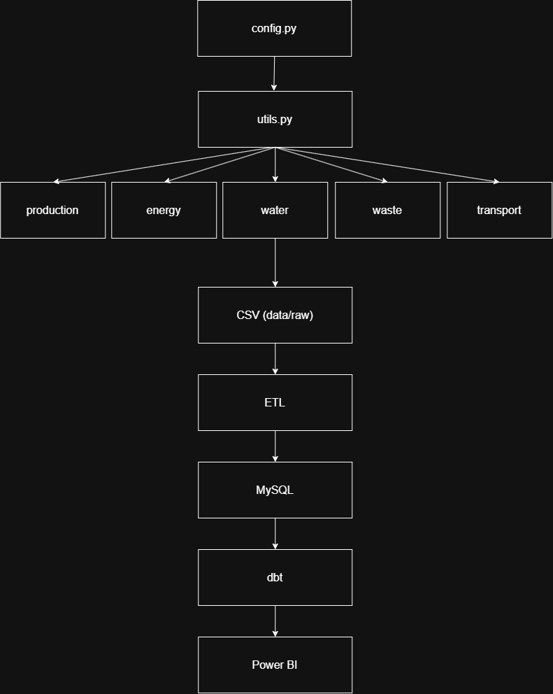

# 📊 Génération des données

## 🎯 Objectif

Cette étape permet de générer automatiquement les données opérationnelles et environnementales utilisées par l'**Industrial Sustainability Data Platform**.

Les données sont produites à partir de règles métier afin de simuler l'activité quotidienne des différents sites industriels de **Helios Industrial Group**.

Cette approche permet d'obtenir un jeu de données cohérent et reproductible destiné à alimenter le pipeline ETL, les transformations réalisées avec dbt ainsi que les tableaux de bord Power BI.

---

# 🔄 Principe général

Les données sont générées automatiquement à l'aide de scripts Python.

Chaque script produit un fichier CSV correspondant à un type de données opérationnelles.

Le processus global est le suivant :

```text
Python
   ↓
Simulation métier
   ↓
Génération des fichiers CSV
   ↓
Pipeline ETL
   ↓
Chargement dans MySQL
   ↓
Transformations avec dbt
   ↓
Data Marts
   ↓
Visualisation dans Power BI
```

---

# 📁 Tables générées

Les tables de référence sont initialisées séparément dans la base de données.

Les jeux de données opérationnels suivants sont générés automatiquement :

| Table | Génération |
|---|---|
| `production` | Oui |
| `energy` | Oui |
| `water` | Oui |
| `waste` | Oui |
| `transport` | Oui |

---

# 📅 Période de génération

La première version du projet génère les données correspondant à une année complète d'activité.

| Paramètre | Valeur |
|---|---|
| Début | 01/01/2025 |
| Fin | 31/12/2025 |
| Nombre de jours | 365 |

Cette période est définie dans la configuration Python et peut être modifiée si nécessaire.

---

# 🏭 Règles métier

Les données générées ne sont pas entièrement aléatoires.

Elles respectent des règles métier permettant de simuler le fonctionnement d'un groupe industriel.

Les principales règles sont les suivantes :

- chaque site industriel fabrique uniquement les produits qui lui sont associés ;
- les volumes de production varient selon le type de produit ;
- certaines productions sont influencées par la saison ;
- l'activité est réduite le week-end ;
- la consommation d'énergie dépend du niveau de production ;
- la consommation d'eau dépend de l'activité industrielle ;
- les déchets sont proportionnels aux volumes produits ;
- les opérations de transport sont générées à partir des fournisseurs et des transporteurs référencés.

---

# 🐍 Architecture Python

Les scripts de génération sont organisés de manière modulaire dans le dossier :

```text
src/
├── etl/
│
└── generators/
    ├── __init__.py
    ├── config.py
    ├── utils.py
    ├── generate_production.py
    ├── generate_energy.py
    ├── generate_water.py
    ├── generate_waste.py
    └── generate_transport.py
```

---

# 🔄 Pipeline de génération

Le diagramme ci-dessous présente l'organisation des scripts Python ainsi que le chemin parcouru par les données, depuis leur génération jusqu'à leur exploitation dans Power BI.



---

# 📄 Description des scripts

## ⚙️ `config.py`

Centralise les principaux paramètres utilisés par les scripts de génération.

Il permet notamment de gérer :

- la période de génération ;
- les chemins des fichiers ;
- les constantes du projet.

---

## 🛠️ `utils.py`

Contient les fonctions communes utilisées par les différents générateurs.

Exemples :

- génération et gestion des dates ;
- gestion de la saisonnalité ;
- calcul des jours de semaine ;
- fonctions utilitaires communes.

---

## 🏭 `generate_production.py`

Génère les données de production quotidienne des différents sites industriels.

---

## ⚡ `generate_energy.py`

Génère les données de consommation énergétique des différents sites.

---

## 💧 `generate_water.py`

Génère les données relatives à la consommation d'eau.

---

## ♻️ `generate_waste.py`

Génère les données relatives aux déchets produits par l'activité industrielle.

---

## 🚚 `generate_transport.py`

Génère les opérations de transport associées aux fournisseurs et aux différents sites industriels.

---

# 📂 Structure des données générées

Les fichiers générés sont enregistrés dans le dossier :

```text
data/raw/
```

Les principaux fichiers produits sont :

```text
production.csv
energy.csv
water.csv
waste.csv
transport.csv
```

Ces fichiers constituent les données sources utilisées par le pipeline ETL.

---

# 🔗 Intégration dans la plateforme

Une fois les fichiers CSV générés, ils sont intégrés dans le pipeline global de la plateforme.

```text
Générateurs Python
        ↓
   Fichiers CSV
        ↓
    Pipeline ETL
        ↓
      MySQL
        ↓
       dbt
        ↓
    Data Marts
        ↓
    Power BI
```

Les générateurs constituent donc le point de départ du traitement des données dans l'architecture globale du projet.

---

# 🔮 Évolutions possibles

La génération des données pourrait être enrichie à l'avenir avec :

- l'intégration d'une API météo afin d'influencer certains indicateurs ;
- la prise en compte des jours fériés ;
- l'amélioration des modèles de génération ;
- la génération de données sur une période plus longue.

---

# ✅ Conclusion

La génération automatique des données constitue le point de départ de la plateforme.

Elle permet de produire un volume important de données cohérentes tout en simulant le fonctionnement d'un environnement industriel réaliste.

Les fichiers générés alimentent ensuite le pipeline ETL développé en Python, sont chargés dans MySQL, transformés avec dbt, orchestrés avec Apache Airflow et finalement exploités dans les tableaux de bord Power BI.
